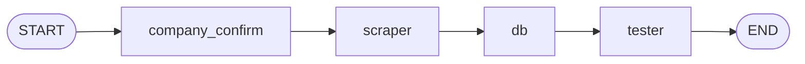

# job-chatbot-langchain

A conversational, multi-agent job-search chatbot built with
[LangChain](https://python.langchain.com/) and
[LangGraph](https://langchain-ai.github.io/langgraph/). You type a request
like *"get all jobs from PwC related to AI"*, and a four-node LangGraph
state graph orchestrates specialised agents to confirm the company, scrape
the Workday careers site, persist the rows to CSV + SQLite, and validate
the output.

---

## For non-technical users

This is a small command-line tool. You type a question in plain English —
*"find AI jobs at PwC in Bangalore"* — and it saves a spreadsheet of
matching open roles to your computer. No browsing, no copy-pasting, no
duplicates.

**Full step-by-step instructions:** see
[`docs/USER-MANUAL.md`](docs/USER-MANUAL.md). It covers installing
prerequisites, configuring your API key, running the bot, reading the
output, and troubleshooting.

**Prerequisites:**

- Python 3.11 or newer
- An [Anthropic API key](https://console.anthropic.com/) (optional but
  recommended — the bot has a regex fallback for offline use)
- [`uv`](https://docs.astral.sh/uv/) for dependency management

### Example session

```
you > find AI jobs at PwC in Bangalore
  [CompanyConfirm] Resolved 'pwc' -> PricewaterhouseCoopers. Keywords='AI', location='Bangalore'.
  [Scraper] Retrieved 42 postings from PricewaterhouseCoopers.
  [DB] Persisted 42 postings -> output/pricewaterhousecoopers.csv and output/pricewaterhousecoopers.sqlite.
  [Tester] PASS: rows=42, unique_ids=42, issues=[]
```

### Supported companies

| Alias examples           | Canonical name           |
|--------------------------|--------------------------|
| `pwc`, `pricewaterhousecoopers`, `pwc india` | PricewaterhouseCoopers |
| `jpmorgan`, `jpmc`, `jp morgan`, `chase`     | JPMorgan Chase         |
| `salesforce`, `sfdc`                          | Salesforce             |
| `cisco`                                       | Cisco                  |
| `adobe`                                       | Adobe                  |
| `nvidia`                                      | NVIDIA                 |
| `netflix`                                     | Netflix                |
| `workday`                                     | Workday                |

---

## For developers

### Architecture summary

A compiled LangGraph `StateGraph` with four nodes wired in a fixed linear
topology. Each node is a Python function over a shared `ChatState`
`TypedDict`; each owns a `ChatAnthropic` model bound to one or more
`@tool`-decorated functions.



- **CompanyConfirm** — parses the user message, resolves the company alias
  to a Workday tenant.
- **Scraper** — calls Workday's `/wday/cxs/{tenant}/{site}/jobs` endpoint,
  paginates, deduplicates by job ID (regex `_([A-Z0-9-]+WD)(?:-\d+)?$`).
- **DB** — writes CSV + SQLite under `output/`. SQLite PK is
  `(company, job_id)` so re-runs upsert cleanly.
- **Tester** — validates the CSV (schema, row count, unique IDs).

For the full design — sequence diagrams, state machine, failure modes,
testing strategy, extension points — see
[`docs/SYSTEM-DESIGN.md`](docs/SYSTEM-DESIGN.md).

### Tech stack

| Layer | Library |
|---|---|
| Multi-agent orchestration | `langgraph` >= 0.2 |
| LLM client + tool binding | `langchain` >= 0.3, `langchain-anthropic` >= 0.3 |
| Model | `claude-sonnet-4-5` (temperature 0) |
| HTTP | `httpx` |
| CLI | `rich`, `argparse` |
| Persistence | stdlib `csv`, `sqlite3` |
| Config | `python-dotenv` |
| Tests | `pytest` |
| Packaging | `uv`, `hatchling` |

### Code layout

```
src/job_chatbot_langchain/
  __init__.py
  main.py                  # CLI entry point (REPL + one-shot)
  graph.py                 # build_graph() + run_chat()
  state.py                 # ChatState TypedDict
  models.py                # JobQuery, JobPosting, ValidationReport
  agents/
    company_confirm.py     # CompanyConfirm node + resolve_company_tool
    scraper.py             # Scraper node + workday_search_tool
    db.py                  # DB node + write_csv_tool, write_sqlite_tool
    tester.py              # Tester node + validate_csv_tool
  tools/
    companies.py           # registry + alias table
    workday.py             # httpx client, pagination, dedup regex
    storage.py             # CSV + SQLite writers
tests/
  test_smoke.py            # offline end-to-end (no live HTTP, no LLM)
docs/
  USER-MANUAL.md
  SYSTEM-DESIGN.md
```

### Quickstart

```bash
git clone git@github.com:mahadevaiahrashmi/job-chatbot-langchain.git
cd job-chatbot-langchain
uv venv
uv sync
cp .env.example .env  # then paste your ANTHROPIC_API_KEY
uv run job-chatbot-langchain
```

One-shot mode:

```bash
uv run job-chatbot-langchain "find AI jobs at PwC in Bangalore"
```

### Tests

```bash
uv run pytest -q
```

The smoke suite unsets `ANTHROPIC_API_KEY` and monkeypatches the Workday
HTTP client, so the full graph runs end-to-end with no network and no
secrets. Safe for CI.

### License

MIT. See [LICENSE](LICENSE).
