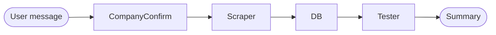

# job-chatbot-langchain

A conversational, multi-agent job-search chatbot built with
[LangChain](https://python.langchain.com/) and
[LangGraph](https://langchain-ai.github.io/langgraph/). You type a request like
"get all jobs from PwC related to AI", and a four-node LangGraph state graph
orchestrates specialised agents to confirm the company, scrape the Workday
careers site, persist the rows to CSV + SQLite, and validate the output. Each
node runs a `ChatAnthropic` model bound to focused `@tool`-decorated functions,
showcasing LangGraph's multi-agent orchestration with a clean shared state.

## Graph topology



ASCII fallback:

```
user message
     |
     v
[CompanyConfirm] --> [Scraper] --> [DB] --> [Tester] --> summary
```

Each node mutates a shared `ChatState` `TypedDict`:

- **CompanyConfirm** parses the user message and uses `resolve_company_tool`
  to normalise the company alias (e.g. `pwc` -> `PricewaterhouseCoopers`).
- **Scraper** calls `workday_search_tool`, which POSTs to
  `/wday/cxs/{tenant}/{site}/jobs`, paginates through results, and
  deduplicates by job ID using the regex `_([A-Z0-9-]+WD)(?:-\d+)?$`
  (so `_712616WD-2` collapses to `712616WD`).
- **DB** persists postings via `write_csv_tool` + `write_sqlite_tool`
  (SQLite primary key is `(company, job_id)`, so re-runs upsert cleanly).
- **Tester** runs `validate_csv_tool` and reports `ok / row_count /
  unique_job_ids / issues`. A run is healthy only when row count > 0
  and all job IDs are unique.

## Quickstart

```bash
git clone git@github.com:mahadevaiahrashmi/job-chatbot-langchain.git
cd job-chatbot-langchain
uv venv
uv sync
cp .env.example .env  # then paste your ANTHROPIC_API_KEY
uv run job-chatbot-langchain
```

You can also run a one-shot query:

```bash
uv run job-chatbot-langchain "find AI jobs at PwC in Bangalore"
```

## Example session

```
you > find AI jobs at PwC in Bangalore
  [CompanyConfirm] Resolved 'pwc' -> PricewaterhouseCoopers. Keywords='AI', location='Bangalore'.
  [Scraper] Retrieved 42 postings from PricewaterhouseCoopers.
  [DB] Persisted 42 postings -> output/pricewaterhousecoopers.csv and output/pricewaterhousecoopers.sqlite.
  [Tester] PASS: rows=42, unique_ids=42, issues=[]
```

## Supported companies

| Alias examples           | Canonical name           |
|--------------------------|--------------------------|
| `pwc`, `pricewaterhousecoopers`, `pwc india` | PricewaterhouseCoopers |
| `jpmorgan`, `jpmc`, `jp morgan`, `chase`     | JPMorgan Chase         |
| `salesforce`, `sfdc`                          | Salesforce             |
| `cisco`                                       | Cisco                  |
| `adobe`                                       | Adobe                  |
| `nvidia`                                      | NVIDIA                 |
| `netflix`                                     | Netflix                |
| `workday`                                     | Workday                |

Add more by extending `src/job_chatbot_langchain/tools/companies.py`.

## Tests

```bash
uv run pytest -q
```

The smoke test runs the full LangGraph end-to-end without contacting the
Anthropic API (the HTTP call is monkeypatched), so it works offline and is
safe for CI.

## License

MIT. See [LICENSE](LICENSE).
