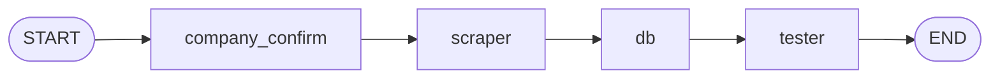
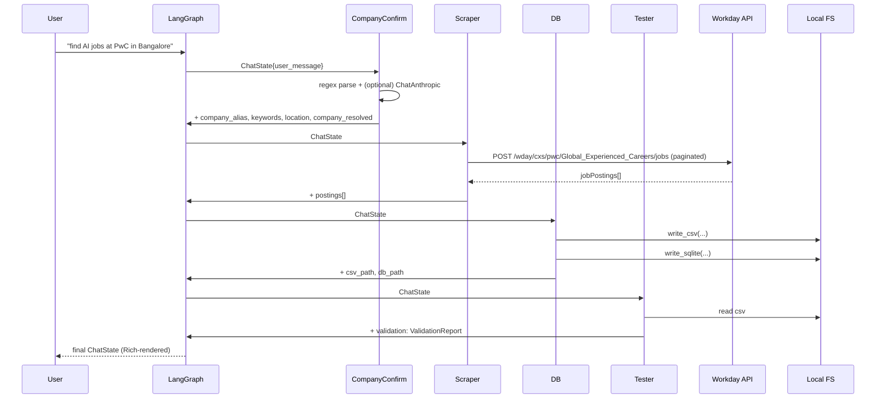

# System Design

Engineering-facing architecture document for `job-chatbot-langchain`. Pair
this with the [user manual](./USER-MANUAL.md) if you want a non-technical
walkthrough first.

## Problem statement

Job seekers regularly want to ask a natural-language question — *"what AI
roles are open at PwC in Bangalore right now?"* — and get back a clean,
structured, deduplicated list of postings they can sort, filter, or import
elsewhere. Doing this by hand means visiting each company's careers site,
working around their JavaScript-heavy UIs, copy-pasting rows into a
spreadsheet, and reconciling duplicates across regional sub-sites. Every
step is mechanical, and the data is sitting in a JSON endpoint that
Workday already exposes publicly.

`job-chatbot-langchain` automates the round-trip: parse the user's free-form
message, resolve the company to a Workday tenant, paginate through the
search endpoint, persist the rows to CSV + SQLite, and validate the output.
It does this with a four-node LangGraph state graph so that each step is
an isolated, testable agent with its own model, prompt, and bound tools.

## High-level architecture

The system is a compiled LangGraph `StateGraph` with four nodes in a fixed
linear topology.



A single user query flows through the four agents like this:



## Why LangGraph

LangChain alone supplies the LLM client, prompt plumbing, and `@tool`
decorator. LangGraph adds three things that matter for this project:

1. **Explicit, inspectable state.** Every agent receives and returns the
   same `ChatState` `TypedDict`. There's no hidden chain memory — you can
   print the state between any two nodes and see exactly what's happening.
2. **Typed, declarative transitions.** Adding, removing, or re-ordering a
   node is one `add_edge` call. That makes future work (a conditional
   "skip scrape if cached" edge, a fan-out to multiple companies) cheap.
3. **Testability.** Because nodes are plain Python functions over a
   `TypedDict`, the smoke test invokes the entire compiled graph without
   any LLM call — see `tests/test_smoke.py`.

The trade-off versus a single ReAct agent is that the topology is fixed at
compile time and routing decisions can't be made by the model itself. For
this problem that's a feature, not a limitation.

## State machine

The shared state object is `ChatState` in
`src/job_chatbot_langchain/state.py`:

```python
class ChatState(TypedDict, total=False):
    user_message: str
    company_alias: str
    company_canonical: str
    company_resolved: bool
    keywords: str
    location: str | None
    limit: int
    postings: list[JobPosting]
    csv_path: str
    db_path: str
    validation: ValidationReport
    messages: list[str]
    extras: dict[str, Any]
```

Fields are populated incrementally; `total=False` lets each node write only
what it produces. The convention is that nodes always return a **new**
`ChatState` via `{**state, ...}` rather than mutating the input.

Per node, what is read and what is written:

| Node | Reads | Writes |
|---|---|---|
| `company_confirm` | `user_message` | `company_alias`, `company_canonical`, `company_resolved`, `keywords`, `location`, `limit`, `messages` |
| `scraper` | `company_alias`, `company_resolved`, `keywords`, `location`, `limit` | `postings`, `messages` |
| `db` | `postings`, `company_canonical`, `company_alias`, `extras.output_dir` | `csv_path`, `db_path`, `messages` |
| `tester` | `csv_path` | `validation`, `messages` |

`messages` is an append-only list of human-readable narration strings the
CLI prints at the end. `extras` is a free-form dict the CLI uses to pass
`output_dir` into the DB node without polluting the typed shape.

## Component breakdown

### CompanyConfirm

- **Role:** parse the user's message, extract `company_alias` /
  `keywords` / `location`, and confirm the alias maps to a Workday tenant
  the registry knows about.
- **Model:** `ChatAnthropic` with `model="claude-sonnet-4-5"`,
  `temperature=0` (only when `ANTHROPIC_API_KEY` is set).
- **Bound tools:** `resolve_company_tool(name)` — returns
  `{canonical_name, tenant, site, base_url}` or `{"error": "unknown"}`.
- **Inputs:** `state["user_message"]`.
- **Outputs:** `company_alias`, `company_canonical`, `company_resolved`,
  `keywords`, `location`, `limit`.
- **Failure modes:** alias not in registry — node still returns cleanly
  with `company_resolved=False`, and the Scraper short-circuits.

A deterministic regex pre-parse runs first so the graph works offline
(this is what the smoke test exercises). The LLM call refines the
extraction when a key is available.

```python
# src/job_chatbot_langchain/agents/company_confirm.py
llm = ChatAnthropic(
    model="claude-sonnet-4-5",
    temperature=0,
).bind_tools([resolve_company_tool])
response = llm.invoke([("system", prompt), ("user", message)])
```

### Scraper

- **Role:** call the Workday search endpoint and produce a deduplicated
  `list[JobPosting]`.
- **Model:** `ChatAnthropic` `claude-sonnet-4-5`, `temperature=0` (only
  for "narration" when a key is set; the real HTTP work is always
  deterministic).
- **Bound tools:** `workday_search_tool(company_alias, keywords, location,
  limit)` — wraps `tools.workday.search_jobs`.
- **Inputs:** `company_alias`, `keywords`, `location`, `limit`.
- **Outputs:** `postings`.
- **Failure modes:** Workday returns an HTTP error → caught, recorded in
  `messages`, `postings` set to `[]`. Company already failed to resolve →
  node logs "Skipped" and returns immediately.

The deterministic HTTP call always runs regardless of LLM availability,
which keeps the graph's behaviour predictable and tests fast.

### DB

- **Role:** persist `postings` to CSV and SQLite under `output/`.
- **Model:** `ChatAnthropic` `claude-sonnet-4-5`, `temperature=0` (narration
  only).
- **Bound tools:** `write_csv_tool(rows, path)`,
  `write_sqlite_tool(rows, path)`.
- **Inputs:** `postings`, `company_canonical` (or `company_alias`),
  `extras["output_dir"]`.
- **Outputs:** `csv_path`, `db_path` (absolute paths).
- **Failure modes:** empty `postings` → node logs "Skipped" with empty
  paths; Tester will then FAIL on the missing CSV.

Output filenames are slugged from the canonical company name:

```python
def _slug(name: str) -> str:
    return re.sub(r"[^a-z0-9]+", "_", name.lower()).strip("_") or "jobs"
```

So `PricewaterhouseCoopers` becomes `pricewaterhousecoopers.csv` and
`pricewaterhousecoopers.sqlite`.

### Tester

- **Role:** validate the CSV produced by the DB node.
- **Model:** `ChatAnthropic` `claude-sonnet-4-5`, `temperature=0` (narration
  only).
- **Bound tools:** `validate_csv_tool(path)` — returns
  `{ok, row_count, unique_job_ids, issues}`.
- **Inputs:** `csv_path`.
- **Outputs:** `validation: ValidationReport`.
- **Failure modes:** CSV missing, schema incomplete, zero rows, or
  duplicate `job_id` values → `ok=False` with a list of `issues`.

Validation rules (from `tester.py`):

```python
REQUIRED_FIELDS = ["company", "job_id", "title", "location", "posted_on", "url"]
# fails on: missing CSV, missing required columns,
#          row_count == 0, len(unique_job_ids) != len(job_ids)
```

## Tools layer

### `tools/workday.py`

Thin httpx client around the unauthenticated Workday search endpoint:

```
POST {base_url}/wday/cxs/{tenant}/{site}/jobs
body: {"appliedFacets": {}, "limit": 20, "offset": 0, "searchText": "<keywords>"}
```

Key behaviours:

- **Pagination.** Page size is fixed at 20. The loop keeps requesting
  pages until either `limit` results have been collected, the response
  returns an empty `jobPostings` array, or `offset >= data["total"]`.
- **Deduplication.** Workday sometimes surfaces the same role on multiple
  regional sites with a `-1` / `-2` suffix on the `externalPath`. The
  regex `_([A-Z0-9-]+WD)(?:-\d+)?$` extracts the canonical ID
  (`712616WD`) and a `seen_ids` set drops the duplicates.
- **Location filter.** Applied client-side via a case-insensitive
  substring check against `locationsText`, because Workday's facet API
  varies between tenants.

### `tools/companies.py`

Static registry of the eight supported companies plus an alias table.
`Company` is a frozen dataclass: `(canonical_name, base_url, tenant,
site)`. `resolve_company(name)` lowercases, collapses whitespace, and
looks the key up first in `_REGISTRY` then in `_ALIASES`. Adding a new
company is one entry in `_REGISTRY` and (optionally) aliases.

### `tools/storage.py`

Two functions:

- `write_csv(postings, path)` — `csv.DictWriter`, `utf-8`, header row
  first, columns: `company, job_id, title, location, posted_on, url`.
- `write_sqlite(postings, path)` — creates the schema if it doesn't
  exist and `INSERT OR REPLACE`s every row:

```sql
CREATE TABLE IF NOT EXISTS job_postings (
    company   TEXT NOT NULL,
    job_id    TEXT NOT NULL,
    title     TEXT NOT NULL,
    location  TEXT,
    posted_on TEXT,
    url       TEXT,
    PRIMARY KEY (company, job_id)
)
```

The composite primary key means re-running the bot for a company
upserts cleanly — no manual cleanup, no duplicate rows even across
many runs.

## Data model

`src/job_chatbot_langchain/models.py` defines three dataclasses:

```python
@dataclass
class JobQuery:
    company: str
    keywords: str
    location: str | None = None
    limit: int = 100

@dataclass
class JobPosting:
    company: str
    job_id: str
    title: str
    location: str
    posted_on: str
    url: str
    def to_dict(self) -> dict[str, str]: ...

@dataclass
class ValidationReport:
    ok: bool
    row_count: int
    unique_job_ids: int
    issues: list[str] = field(default_factory=list)
```

`JobQuery` is not currently wired into `ChatState` — the parsed query
fields live directly on the state for now. It's kept around because the
shape is useful for future refactors (e.g. fan-out to multiple companies).

## Sequence: a single query end-to-end

User runs `uv run job-chatbot-langchain "find AI jobs at PwC in Bangalore"`.

1. **CLI startup.** `main.py` calls `load_dotenv()`, parses args, prints
   the welcome panel, and invokes `run_chat("find AI jobs at PwC in
   Bangalore", output_dir="output", limit=100)`.
2. **Graph build & invoke.** `run_chat` calls `build_graph()` which
   compiles the `StateGraph` and invokes it with an initial state of
   `{user_message, limit, messages: [], extras: {output_dir}}`.
3. **CompanyConfirm.** Regex pre-parse extracts `company_alias="pwc"`,
   `keywords="AI"`, `location="Bangalore"`. With an API key set, the LLM
   call refines this (typically a no-op for clean inputs). `resolve_company("pwc")`
   returns the PwC Workday entry. State now includes
   `company_canonical="PricewaterhouseCoopers"`, `company_resolved=True`.
4. **Scraper.** `workday.search_jobs(...)` POSTs to
   `https://pwc.wd3.myworkdayjobs.com/wday/cxs/pwc/Global_Experienced_Careers/jobs`
   with `searchText="AI"`. It paginates 20 results at a time, applies the
   regex to extract job IDs, drops duplicates, and filters by
   `"bangalore" in locationsText.lower()`. Returns e.g. 42
   `JobPosting`s.
5. **DB.** Slug is `pricewaterhousecoopers`. `write_csv` produces
   `output/pricewaterhousecoopers.csv`; `write_sqlite` produces
   `output/pricewaterhousecoopers.sqlite`. Both absolute paths land on
   the state.
6. **Tester.** `validate_csv_tool` opens the CSV, checks columns, counts
   rows and unique IDs, returns
   `{ok: True, row_count: 42, unique_job_ids: 42, issues: []}`. A
   `ValidationReport` is attached to the state.
7. **CLI summary.** `main._print_summary` prints the narration lines, a
   Rich table of the first 10 postings, and a PASS panel.

## Persistence layer

**CSV** (`output/<slug>.csv`)

UTF-8 with a header row. One row per posting. Columns in order:
`company, job_id, title, location, posted_on, url`.

**SQLite** (`output/<slug>.sqlite`)

A single table `job_postings` with the same six columns and a composite
primary key `(company, job_id)`. The DB is created on first write
(`CREATE TABLE IF NOT EXISTS`). Subsequent runs `INSERT OR REPLACE` —
meaning rows for the same `(company, job_id)` are updated in place and
new IDs are appended. No migrations needed.

If you want a single shared DB across all companies, point the DB node
at one path instead of slugging per-company; the schema already supports
it because the PK includes `company`.

## Failure modes and recovery

| Failure | Where it happens | What the graph does |
|---|---|---|
| Unknown company alias | `company_confirm` | `company_resolved=False`; Scraper/DB skip; Tester reports FAIL with `"No CSV produced by DB agent."` |
| Anthropic API key missing | any node | Each node skips its LLM call and runs its deterministic path. Smoke test exercises this. |
| Anthropic API error (rate limit, 5xx) | any node | Caught by `except Exception` around the `llm.invoke` call; deterministic path still runs. |
| Workday HTTP error or timeout | `scraper` | Caught; `messages` records `"[Scraper] Scrape failed: ..."`; `postings=[]`; DB skips; Tester FAILs. |
| Workday returns zero matches | `scraper` | `postings=[]`; DB skips; Tester FAILs with `"CSV not found"`. |
| Duplicate `job_id` in CSV | `tester` | `ok=False`, issue: `"Duplicate job_id values detected."` (Scraper-side dedup should prevent this; the test is defence-in-depth.) |
| Disk write failure | `db` | Currently propagates (no try/except around `write_csv`/`write_sqlite`). Future work: catch and report. |

Recovery is always "fix and rerun" — the graph is idempotent thanks to
CSV overwrite + SQLite upsert.

## Testing strategy

`tests/test_smoke.py` covers five things, none of which contact the
network or the Anthropic API:

1. **`test_graph_builds`** — `build_graph()` returns an invocable object.
2. **`test_job_id_regex_strips_suffix`** — the regex
   `_([A-Z0-9-]+WD)(?:-\d+)?$` correctly normalises both `_712616WD`
   and `_712616WD-2` to `712616WD`.
3. **`test_company_registry_has_eight_companies`** — exactly eight
   canonical names are registered, including `PricewaterhouseCoopers`.
4. **`test_pwc_resolves_via_alias`** — `resolve_company("PwC")` returns
   the right tenant, site, and base URL.
5. **`test_end_to_end_offline`** — `ANTHROPIC_API_KEY` is unset at
   import time, `workday.search_jobs` is monkeypatched to return two
   fake postings, `run_chat` is invoked end-to-end, and the test
   asserts: `company_resolved=True`, two postings, both files written,
   `validation.ok=True`, `row_count=2`, `unique_job_ids=2`.
6. **`test_unknown_company_short_circuits`** — an unknown company
   produces `company_resolved=False`, empty postings, and a failed
   validation (rather than a crash).

The smoke test removes `ANTHROPIC_API_KEY` from `os.environ` *before*
importing the agents — this is what lets the suite run on CI with no
secrets configured.

Run with:

```bash
uv run pytest -q
```

## Security and cost

**Network surface.** Two outbound destinations: each company's Workday
endpoint (HTTPS, unauthenticated, public) and `api.anthropic.com` (only
when a key is set, only for model calls). No inbound connections.

**Secrets.** `ANTHROPIC_API_KEY` is loaded from `.env` via
`python-dotenv`. `.env` is gitignored. No other credentials are required.

**Local data.** CSV and SQLite files contain only public job-posting
metadata. No user PII is collected, stored, or transmitted.

**LLM cost.** Each query makes at most four `ChatAnthropic.invoke`
calls (one per agent) against `claude-sonnet-4-5`. Prompts are short
(system + a one-line user message). Even at conservative pricing this
is well under a cent per query. Running without a key drops the cost
to zero with only a small loss of parsing robustness.

## Extension points

**Add a new node.** Implement a function `def my_node(state: ChatState)
-> ChatState`, export it from `agents/__init__.py`, and add it to
`graph.py`:

```python
graph.add_node("my_node", my_node)
graph.add_edge("tester", "my_node")
graph.add_edge("my_node", END)
```

**Swap the model.** Every agent constructs its own `ChatAnthropic(...)`.
Change the `model=` argument, or factor model construction into a shared
helper in `models.py`.

**Add a conditional edge.** Replace `graph.add_edge(a, b)` with
`graph.add_conditional_edges(a, route_fn, {"yes": b, "no": END})`. Good
candidates: skip Scraper if a recent CSV exists; route to a "summarize"
agent only on PASS; fan out to multiple companies and merge results.

**Add a company.** Add an entry to `_REGISTRY` in
`tools/companies.py`. Optional aliases go in `_ALIASES`. The tenant and
site come from the URL of the company's Workday careers page (look for
`wd*.myworkdayjobs.com/<site>` after a redirect). Run the smoke test —
`test_company_registry_has_eight_companies` will fail with a clear
message that the count has changed; bump the assertion to nine and
you're done.

**Switch persistence.** The DB agent only depends on
`tools/storage.py`. Swap that module for one that writes to Postgres,
S3, or a Google Sheet without touching the graph.

**Tool-side caching.** Wrap `search_jobs` with a TTL cache keyed on
`(tenant, site, keywords, location)` to make re-runs free and the bot
politer to Workday.

## Future work

- **Date filtering.** Parse `posted_on` into a real timestamp and let
  users say "in the last week".
- **Salary, seniority, remote facets.** Workday exposes facets per
  tenant; extracting them needs a per-company schema.
- **Streaming UI.** LangGraph supports streaming node outputs; the CLI
  could narrate each agent's progress live instead of after the run.
- **Multi-company fan-out.** A conditional edge after CompanyConfirm
  could fan out to N parallel Scraper nodes and merge results before
  the DB node.
- **Server mode.** Wrap `run_chat` in a small FastAPI app for a
  browser UI.
- **Better dedup across companies.** Today dedup is per-run; a global
  hash of `(title, location)` could surface the same role posted to
  multiple companies' careers feeds.
- **Resumable graphs.** LangGraph's checkpointers would let a failed
  Scraper resume from where it left off instead of restarting.
